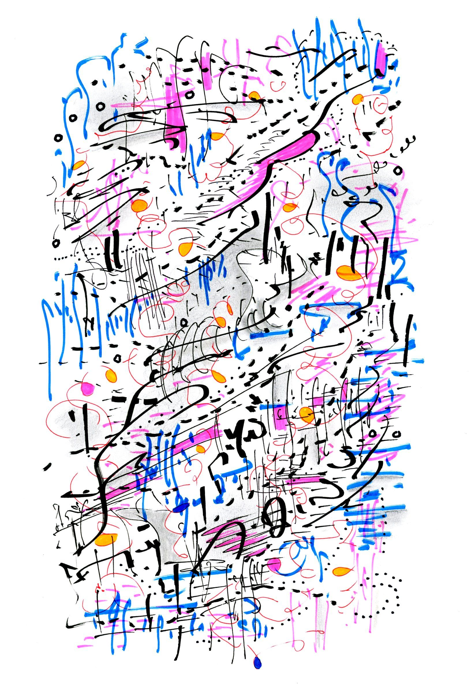

=======
mscales
=======

`mscales` is a Python package to generate, visualize,
and sonify musical scales.

.. toctree::
   :caption: Contents
   :maxdepth: 2

   quickstart
   scales
   pcsets

.. toctree::
   :maxdepth: 1
   :hidden:

   release-history
