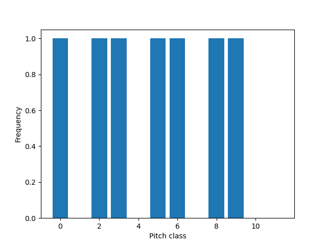

.. Packaging Scientific Python documentation master file, created by
   sphinx-quickstart on Thu Jun 28 12:35:56 2018.
   You can adapt this file completely to your liking, but it should at least
   contain the root `toctree` directive.

mscales Quickstart
==================

Installation
------------

Install `mscales` by entering the following into your terminal::

   pip install mscales

Generation
----------

In `mscales`, musical scales are conceived as binary vectors.
You can generate all scales with chromatic cardinality `c` as follows:

.. code-block:: python

    >>> from mscales.scales import Scales
    >>> s = Scales(c=12)

The variable `scales` has initialized all potential scales with cardinality 12.
In order to access these scales, call the `.all()` method:

>>> scales = s.all()
>>> scales
array([[0, 0, 0, ..., 0, 0, 0],
       [0, 0, 0, ..., 0, 0, 1],
       [0, 0, 0, ..., 0, 1, 0],
       ...,
       [1, 1, 1, ..., 1, 0, 1],
       [1, 1, 1, ..., 1, 1, 0],
       [1, 1, 1, ..., 1, 1, 1]])

This will return a :math:`2^c \times c` numpy array:

>>> scales.shape
(4096, 12)

.. warning::
   Be careful with your choice for `cardinality`!
   Since scales are binary vectors, there are :math:`2^c` scales,
   a number that can `grow very quickly <https://en.wikipedia.org/wiki/Power_of_two>`_
   and seriously slow down your computer.

It is also possible to only generate the scales of chromatic cardinality `c`
with a particular diatonic cardinality `d`:

>>> s = Scales(c=12, d=7)
>>> scales

One can access a specific scale through its row index:

>>> scale = scales[3000,:]
>>> scale
array([1, 0, 1, 1, 1, 0, 1, 1, 1, 0, 0, 0])

The pitch-class represenation of all scales can be obtained
as a list of numpy arrays:

>>> s.pitch_classes()
[array([], dtype=int64),
 array([11]),
 array([10]),
 array([10, 11]),
 ...
 array([2, 3, 4, 5, 6, 9]),
 array([ 2,  3,  4,  5,  6,  9, 11]),
 array([ 2,  3,  4,  5,  6,  9, 10]),
 array([ 2,  3,  4,  5,  6,  9, 10, 11]),
 ...]

and the corresponding interval vectors can be accessed
as a list of Counter objects:

>>> s.interval_vectors()
[Counter(),
 Counter(),
 Counter(),
 Counter({1: 1}),
 ...
 Counter({1: 4, 2: 3, 3: 3, 4: 2, 7: 1, 6: 1, 5: 1}),
 Counter({1: 4, 2: 4, 3: 3, 4: 2, 7: 2, 9: 1, 6: 2, 8: 1, 5: 2}),
 Counter({1: 5, 2: 3, 3: 3, 4: 3, 7: 2, 8: 1, 6: 2, 5: 2}),
 Counter({1: 6, 2: 4, 3: 3, 4: 3, 7: 3, 8: 2, 9: 1, 6: 3, 5: 3}),
 ...]

Plotting
--------

Scales from this collection can then be accessed and plotted:

.. code-block:: python

   import matplotlib.pyplot as plt
   from mscales.plots import plot_scale

   plot_scale(scale)
   plt.show()

Sonification
------------

.. note::
   Currently, we can only synthesize scales with a cardinality of 12
   because `mscales` relies on the `tones` library.

Sonification, the mapping of generated scales to sound,
is achieved with the `sound` module.

.. code-block:: python

   from mscales.sound import tone_cloud

   t = tone_cloud(scale, save_as="example-scale.wav")

.. raw:: html

    <audio controls="controls">
      <source src="_static/example-scale.wav" type="audio/wav">
      Your browser does not support the <code>audio</code> element.
    </audio>

There are lots of parameters to change the sound. They will be documented
in more detail in future releases.

History
-------

.. toctree::
   :maxdepth: 2

   release-history
   min_versions
